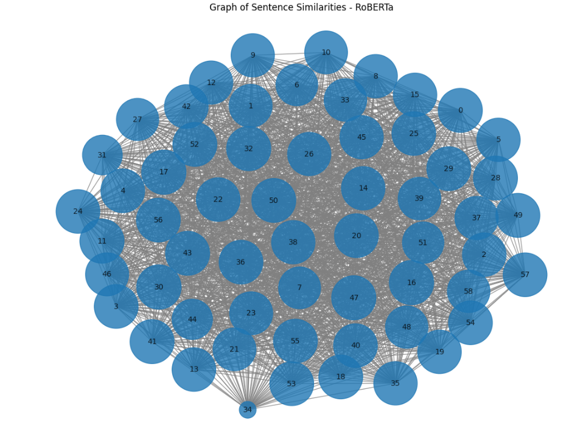

# Sentence Semantic Similarity Comparison

In deep learning and machine learning, there are multiple ways to solve the same problem. For NLP and LLM modeling, quantifying the semantic similarity of sentences is an important challenge to unlock meaning in a text corpus. This notebook compares techniques for characterizing the semantic similarity of sentences. Then, the Louvain, Graph-based community detection algorithm was applied to measure and compare clustering in the results.

The source text for this study was pulled from the NewsAPI public api, using the search term "fusion energy", and then output into a csv file with 59 unique, matching articles spanning 2020 - 2024. By utilizing NewsAPI, this limited the numner of retrieved articles to the channels that NewsAPI has access to, which may not be representative of all news sources. Additionally, the search term "fusion energy" may not be representative of the entire field of fusion energy research, as it may not include all relevant articles.

The following models were used: Spacy vector embedding NLP, Sentence Transformers deep learning, Gensim_word2vec NLP, nltkwordnet NLP, BERT base deep learning, and RoBERTa deep learning. For each model, the results were output as cosine similarity matrices.Networkx graphs were generated on the matrices, and then the Louvain community detection algorithm was applied to the graphs for clustering analysis.

By extracting keywords using TfidfVectorizer, perhaps the most interesting conclusion of this study became apparent: the RoBERTa model was able to identify the most relevant keywords for each community, in my subjective opinion. This suggests that RoBERTa embeddings are more effective at capturing the semantic meaning of sentences, which is crucial for community detection and keyword extraction tasks. The other models, while still effective, may not be as robust in capturing the underlying semantics of the sentences. This highlights the importance of choosing the right model for the task at hand, as different models may excel in different areas based on their architecture and training data.

Overall, this usage of semantic sentence comparison was useful to show how the meaning and concepts within a text can be compared. But it did not assess sentiment or trends, this would be future work to evaluate changes in opinons about a topic over time.

